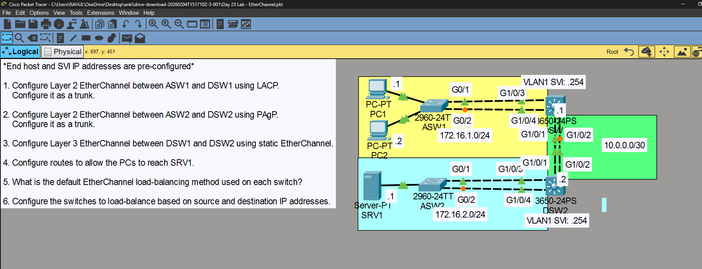
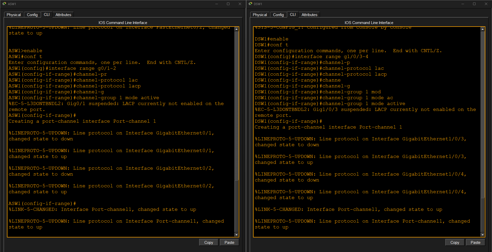
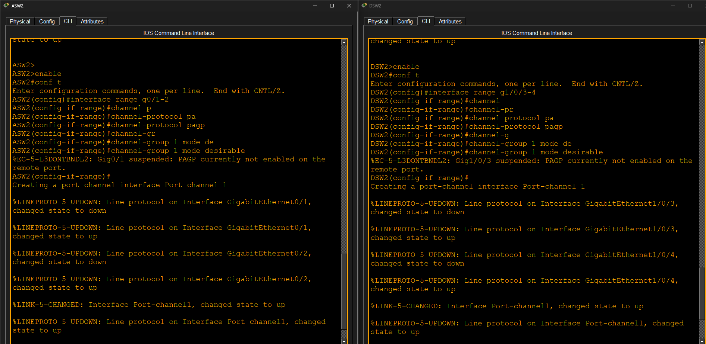
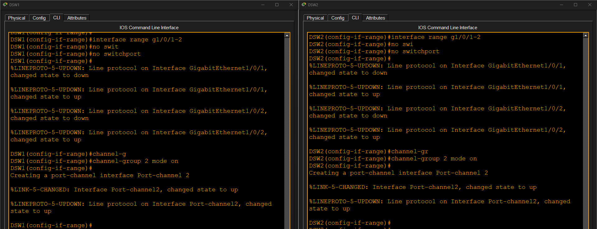
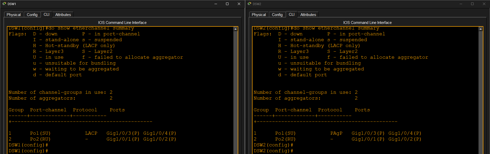
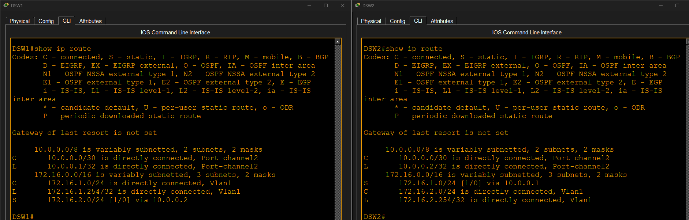
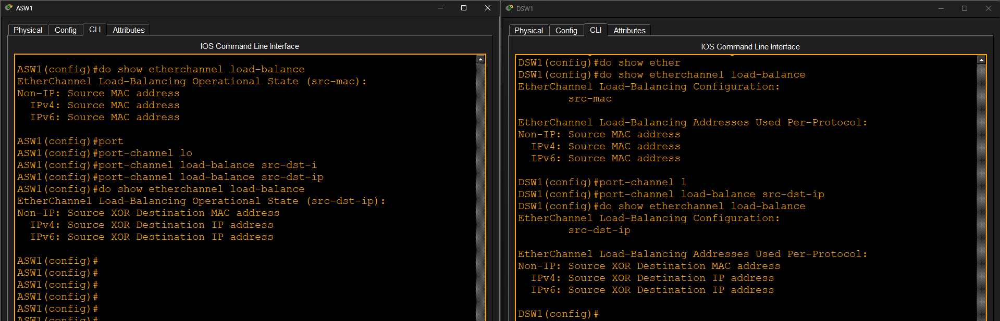
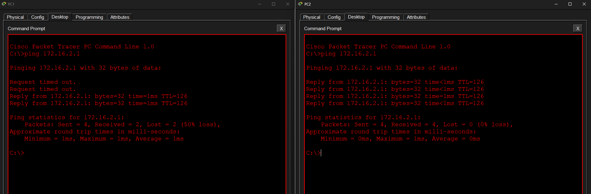

# EtherChannel

## Objective

Configure and verify Layer 2 and Layer 3 EtherChannels using LACP, PAgP, and Static EtherChannel.

---

## Technologies Used

- EtherChannel
- LACP (IEEE 802.3ad)
- PAgP (Cisco Proprietary)
- Static EtherChannel
- Layer 2 EtherChannel
- Layer 3 EtherChannel
- Routing
- EtherChannel Load Balancing

---

## Tasks Completed

- Configured Layer 2 EtherChannel using LACP
- Configured Layer 2 EtherChannel using PAgP
- Configured Layer 3 Static EtherChannel
- Verified EtherChannel status
- Configured EtherChannel load balancing (src-dst-ip)
- Configured routing between switches
- Verified end-to-end connectivity

---

## Result

Successfully configured and verified Layer 2 and Layer 3 EtherChannels with successful routing and end-to-end connectivity.

---

# Screenshots

## 1. Topology

---

## 2. LACP Configuration

---

## 3. PAgP Configuration

---

## 4. Layer 3 EtherChannel

---

## 5. EtherChannel Summary

---

## 6. IP Routing

---

## 7. EtherChannel Load Balancing

---

## 8. Ping Verification

