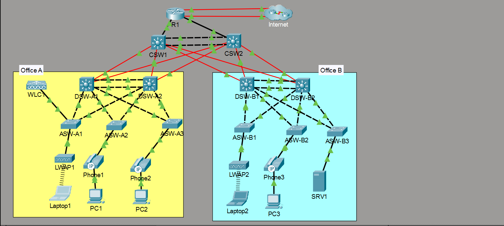
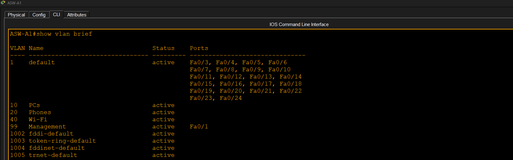
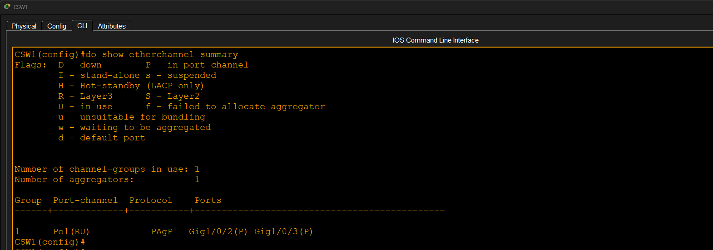
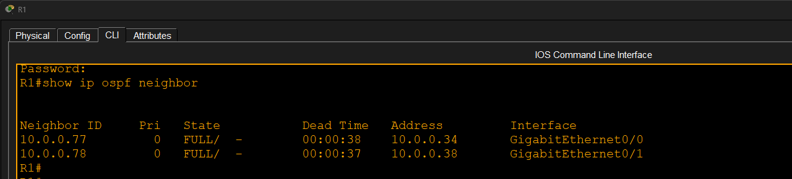
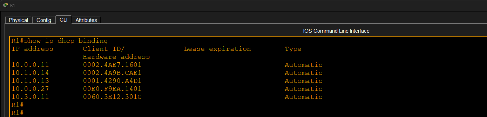
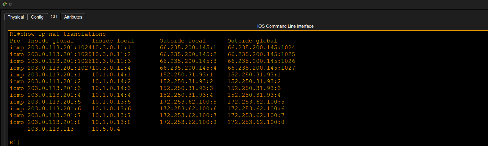
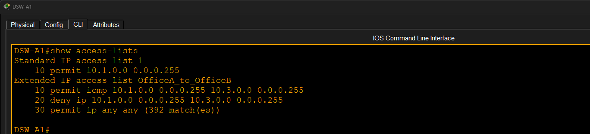
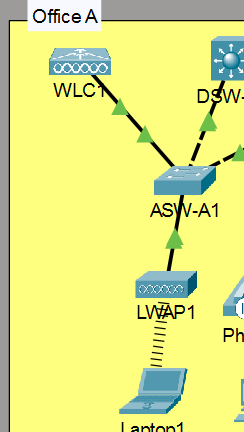
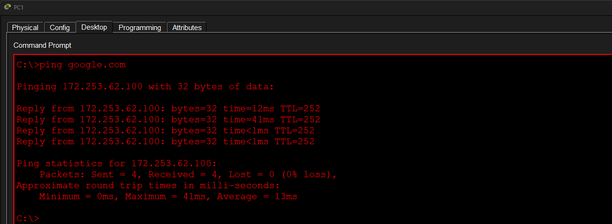
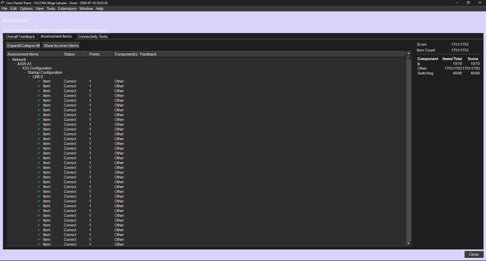

# CCNA Enterprise Mega Lab

## Overview

This project is a complete CCNA Enterprise campus network built in Cisco Packet Tracer. It integrates multiple networking technologies into a single enterprise topology consisting of two office locations connected through a redundant core.

## Technologies Implemented

- VLANs
- 802.1Q Trunking
- Inter-VLAN Routing (SVIs)
- EtherChannel (LACP)
- Rapid PVST+
- HSRP
- OSPF
- DHCP
- NAT/PAT
- Standard ACL
- Extended ACL
- Wireless LAN Controller (WLC)
- Lightweight Access Points (LWAP)
- Voice VLAN
- SSH
- DNS
- IP Phones

## Topology

The enterprise network contains:

- Core Layer
  - CSW1
  - CSW2

- Distribution Layer
  - DSW-A1
  - DSW-A2
  - DSW-B1
  - DSW-B2

- Access Layer
  - ASW-A1
  - ASW-A2
  - ASW-A3
  - ASW-B1
  - ASW-B2
  - ASW-B3

- End Devices
  - PCs
  - Laptops
  - Server
  - IP Phones
  - Wireless Clients

## Result

- Enterprise network successfully configured.
- End-to-end connectivity verified.
- Dynamic routing functioning correctly.
- Redundant gateways operating using HSRP.
- Wireless clients connected successfully.
- DHCP and NAT working properly.
- **Packet Tracer Assessment Score: 1751/1753**.

> **Note:** One Packet Tracer assessment item related to the named extended ACL (`ip access-group OfficeA_to_OfficeB in`) remains ungraded, although the ACL itself is configured and functioning as expected.

---

# Screenshots

## 1. Network Topology

## 2. VLAN Configuration

## 3. EtherChannel

## 4. STP & HSRP

## 5. OSPF

## 6. DHCP

## 7. NAT

## 8. Extended ACL

## 9. Wireless Configuration

## 10. End-to-End Connectivity

## 11. Packet Tracer Assessment

