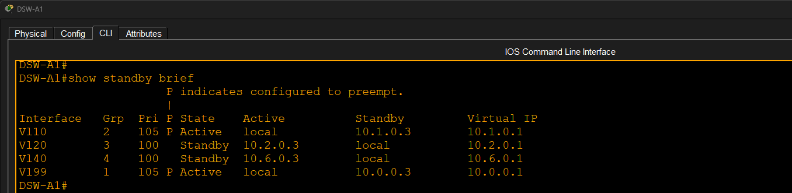

# CCNA Enterprise Mega Lab

## Overview

This project is a complete enterprise network built in Cisco Packet Tracer as part of CCNA practice. The lab combines multiple networking technologies into a single topology with two office locations connected through a redundant core network and Internet access.

## Technologies Implemented

- VLANs
- Inter-VLAN Routing (SVIs)
- 802.1Q Trunking
- EtherChannel (PAgP)
- HSRP
- OSPF
- DHCP
- NAT/PAT
- Standard ACL
- Extended ACL
- Wireless LAN Controller (WLC)
- Lightweight Access Points (LWAP)
- Voice VLAN
- DNS
- End-to-End Connectivity Testing

## Network Topology

- 1 Edge Router (Internet Connectivity)
- 2 Core Switches
- 4 Distribution Switches
- 6 Access Switches
- Wireless LAN Controller
- Lightweight Access Points
- PCs
- Laptops
- IP Phones
- Server

## Verification

The following features were successfully verified:

- VLAN communication
- EtherChannel operation
- HSRP redundancy
- OSPF neighbor relationships
- DHCP address assignment
- NAT translations
- ACL functionality
- Wireless connectivity
- Internet connectivity

## Packet Tracer Assessment

**Score:** **1751 / 1753**

> **Note:** Two assessment points related to the named Extended ACL application were not awarded by the Packet Tracer activity checker. The ACL configuration and network functionality were verified manually.

---

# Screenshots

## 1. Network Topology

---

## 2. VLAN Configuration

---

## 3. EtherChannel

---

## 4. HSRP

---

## 5. OSPF Neighbor Verification

---

## 6. DHCP Bindings

---

## 7. NAT Translations

---

## 8. Access Control Lists

---

## 9. Wireless Connectivity

---

## 10. End-to-End Connectivity Test

---

## 11. Packet Tracer Assessment

