# CCNA Enterprise Mega Lab

## Overview

This project is a complete enterprise network built in Cisco Packet Tracer as part of CCNA practice. The lab combines multiple networking technologies into a single topology with two office locations connected through a redundant core network and Internet access.

## Technologies Implemented

- VLANs
- Inter-VLAN Routing (SVIs)
- 802.1Q Trunking
- EtherChannel (PAgP)
- HSRP
- OSPF
- DHCP
- NAT/PAT
- Standard ACL
- Extended ACL
- Wireless LAN Controller (WLC)
- Lightweight Access Points (LWAP)
- Voice VLAN
- DNS
- End-to-End Connectivity Testing

## Network Topology

- 1 Edge Router (Internet Connectivity)
- 2 Core Switches
- 4 Distribution Switches
- 6 Access Switches
- Wireless LAN Controller
- Lightweight Access Points
- PCs
- Laptops
- IP Phones
- Server

## Verification

The following features were successfully verified:

- VLAN communication
- EtherChannel operation
- HSRP redundancy
- OSPF neighbor relationships
- DHCP address assignment
- NAT translations
- ACL functionality
- Wireless connectivity
- Internet connectivity

## Packet Tracer Assessment

**Score:** **1751 / 1753**

> **Note:** Two assessment points related to the named Extended ACL application were not awarded by the Packet Tracer activity checker. The ACL configuration and network functionality were verified manually.

---

# Screenshots

## Lab Requirements

### Part 1 – Initial Setup

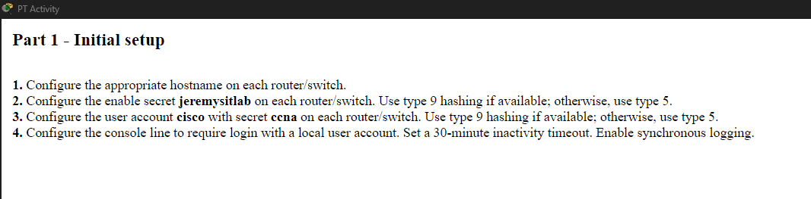

### Part 2 – VLANs & Layer-2 EtherChannel

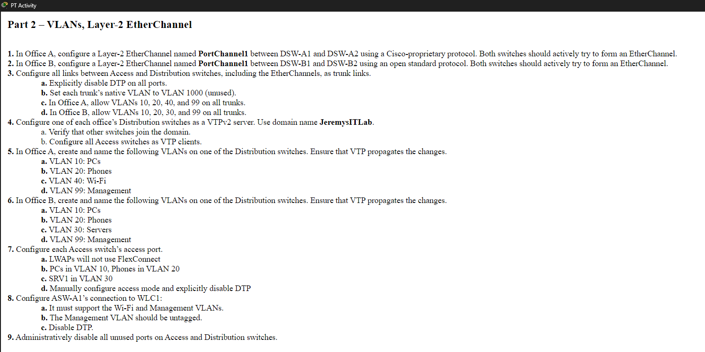

### Part 3 – IP Addressing, Layer-3 EtherChannel & HSRP

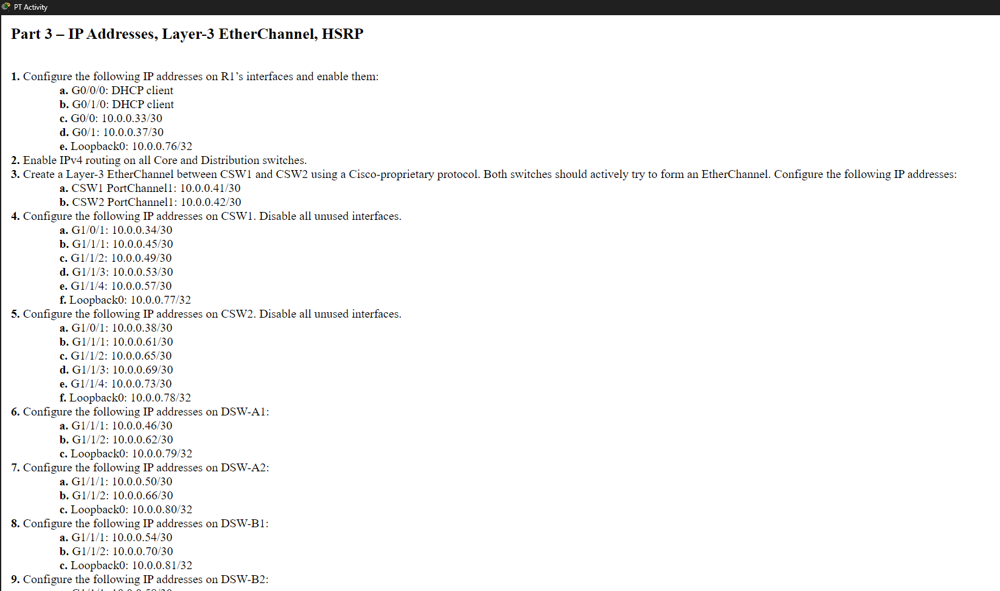

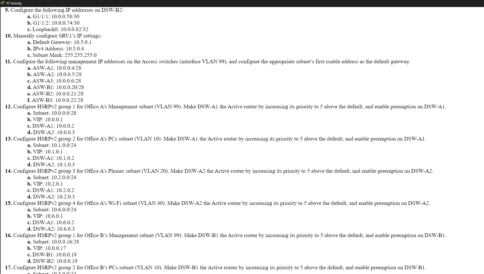

### Part 4 – Rapid Spanning Tree

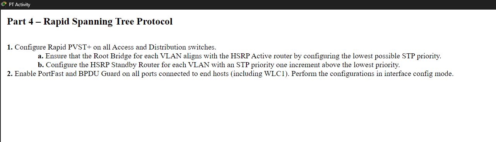

### Part 5 – Static & Dynamic Routing

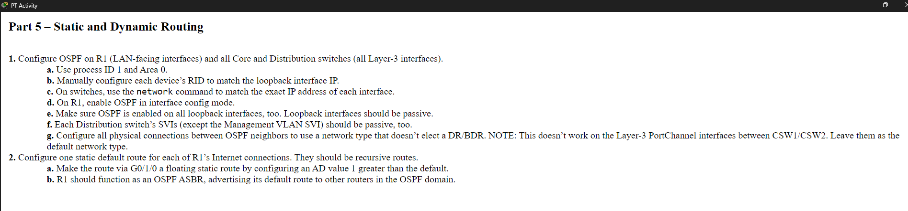

### Part 6 – Network Services

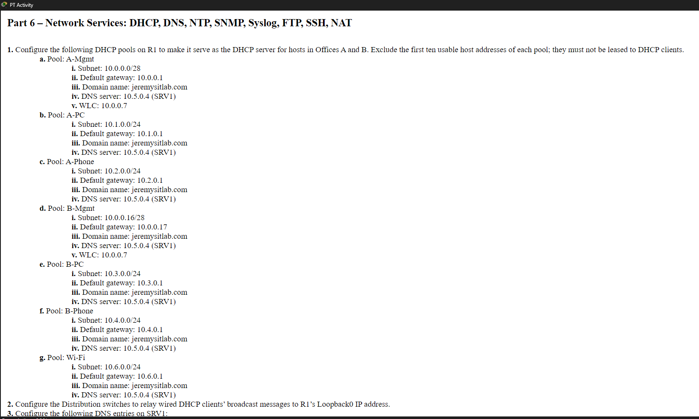

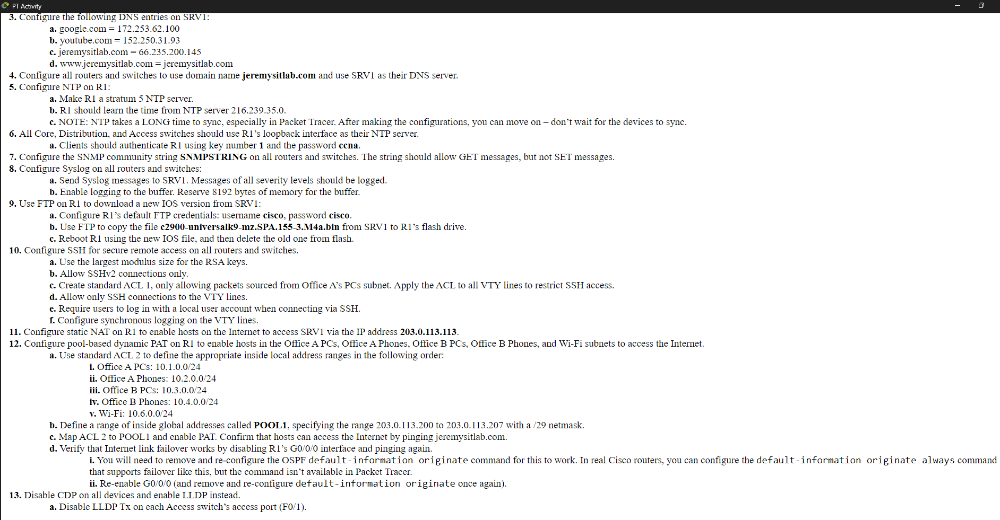

### Part 7 – Security

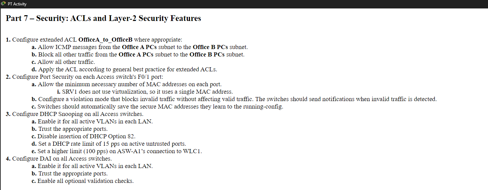

### Part 8 – IPv6

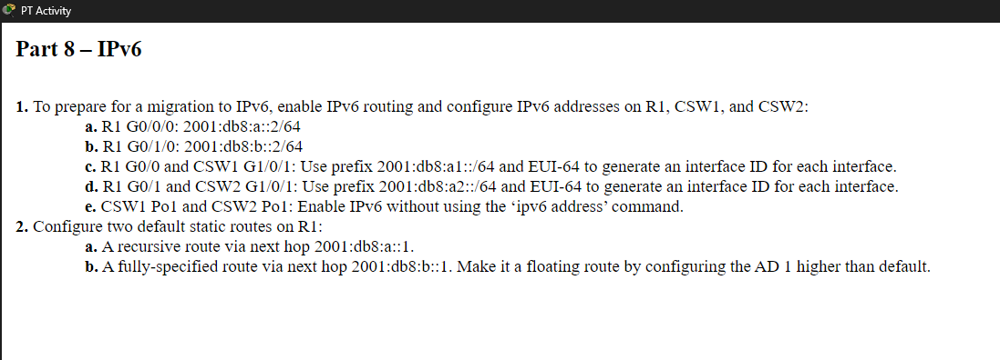

### Part 9 – Wireless

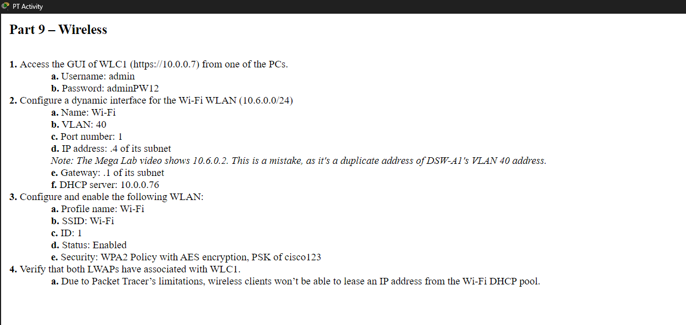

---

## Network Topology

---

## Verification

### VLAN Configuration

### EtherChannel

### HSRP

### OSPF Neighbor Verification

### DHCP Bindings

### NAT Translations

### Access Control Lists

### Wireless Connectivity

### End-to-End Connectivity Test

---

## Packet Tracer Assessment

**Score:** **1751 / 1753**

> **Note:** Two assessment points related to the named Extended ACL application were not awarded by the Packet Tracer activity checker. The ACL configuration and network functionality were verified manually.

