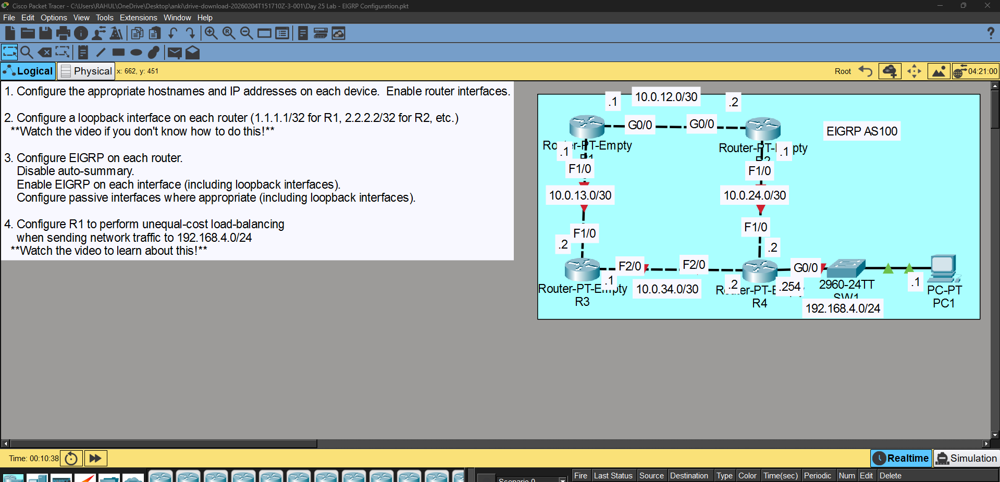
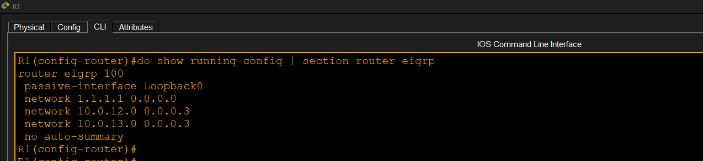
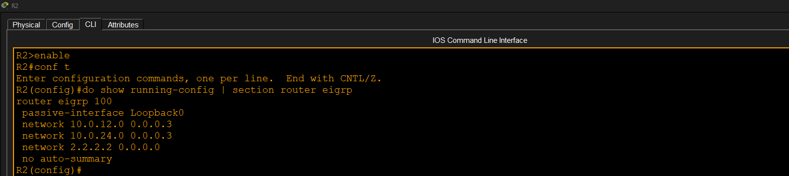
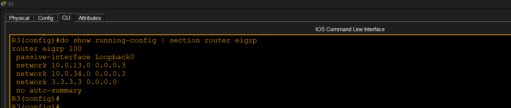
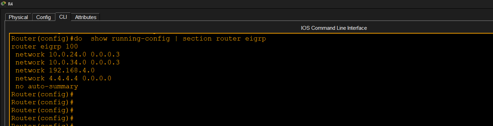
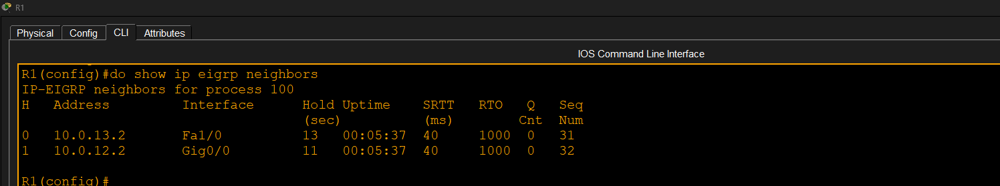
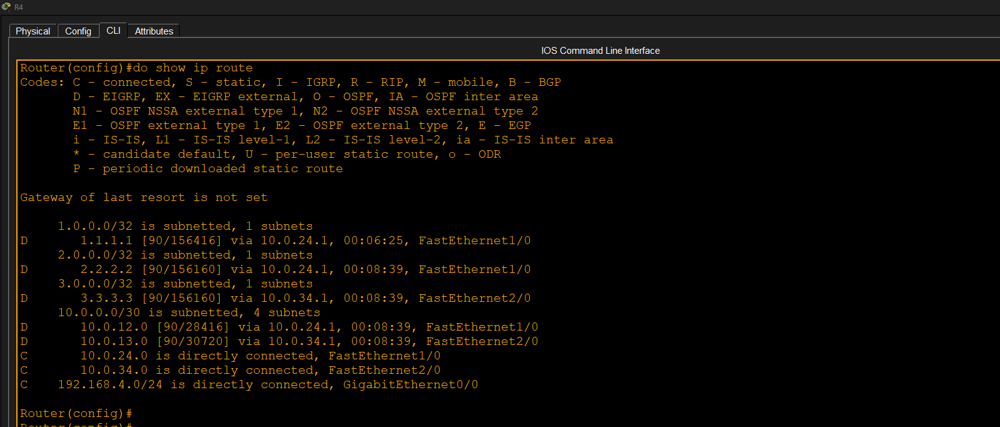
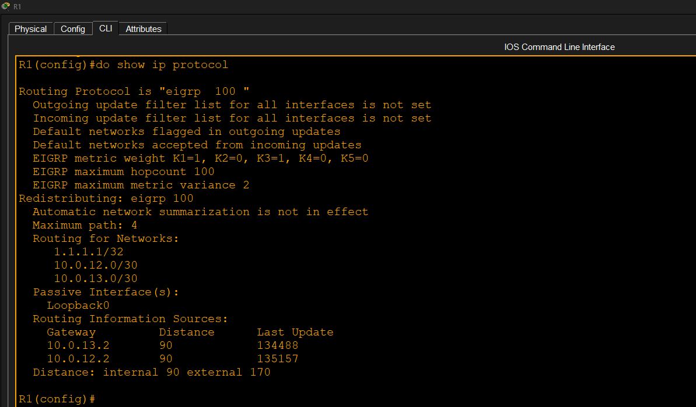
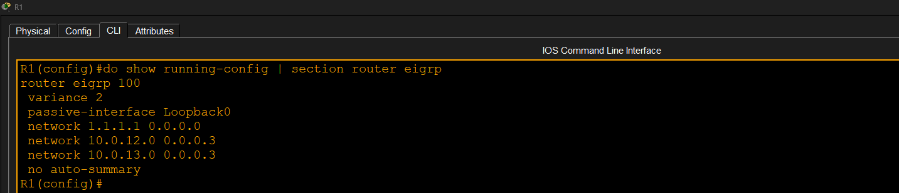
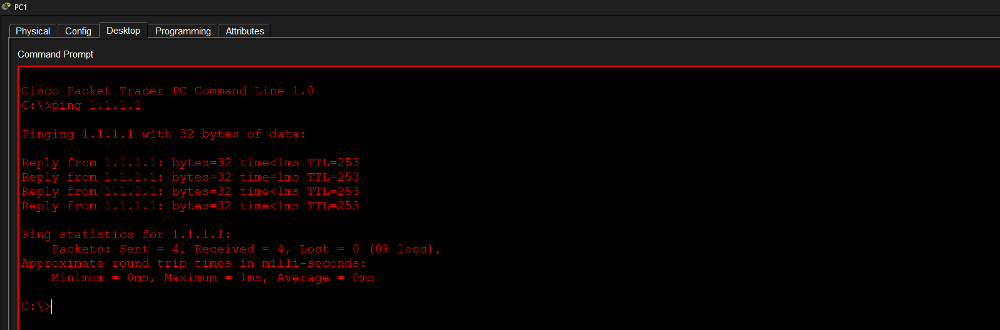

# EIGRP Configuration

## Objective

Configure EIGRP Autonomous System 100, establish neighbor relationships, disable auto-summary, configure passive interfaces, and implement unequal-cost load balancing using variance.

## Tasks Completed

- Configured EIGRP AS 100
- Disabled auto-summary
- Advertised all required networks
- Configured passive interfaces
- Verified EIGRP neighbors
- Verified routing table
- Verified EIGRP protocol configuration
- Configured unequal-cost load balancing using variance
- Verified end-to-end connectivity

## Result

Successfully configured and verified EIGRP routing. Neighbor relationships formed correctly, routing information was exchanged, unequal-cost load balancing was configured, and connectivity was verified.

## Screenshots

### 1. Topology

### 2. R1 EIGRP Configuration

### 3. R2 EIGRP Configuration

### 4. R3 EIGRP Configuration

### 5. R4 EIGRP Configuration

### 6. EIGRP Neighbor Table

### 7. Routing Table

### 8. EIGRP Protocol Information

### 9. Variance Configuration

### 10. Ping Verification

