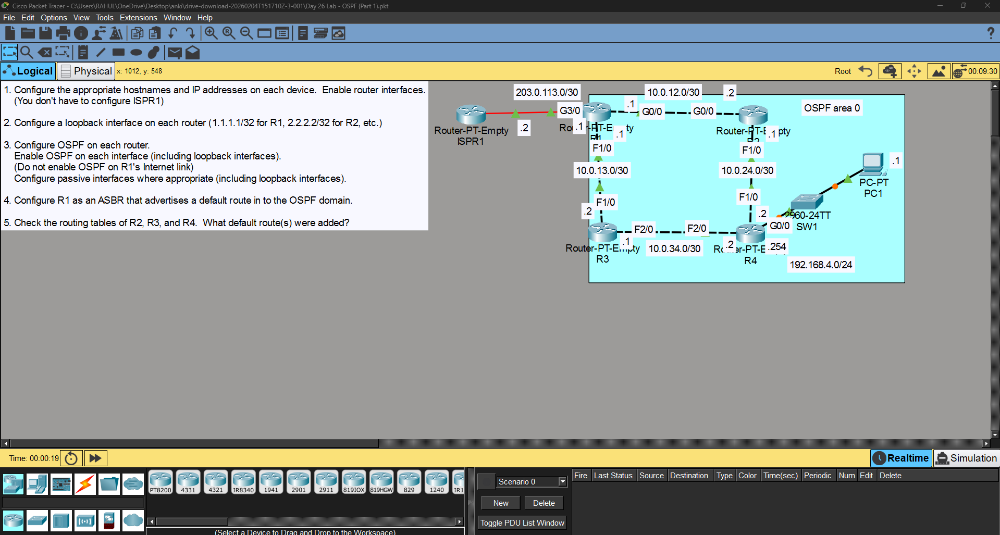
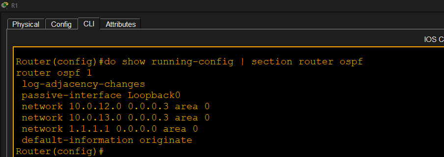
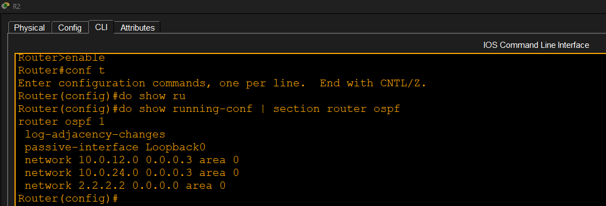
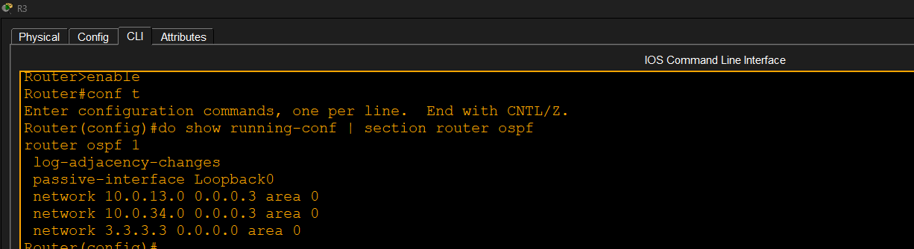
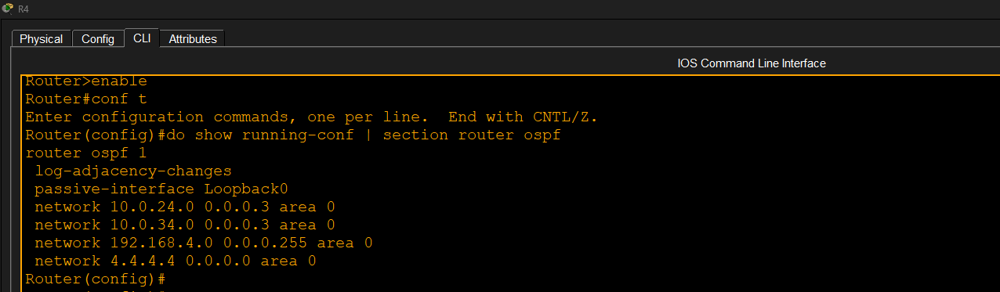
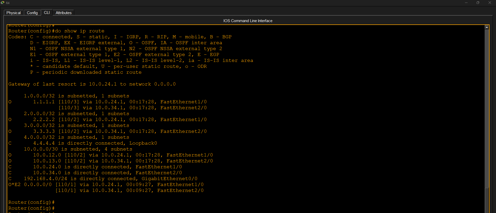
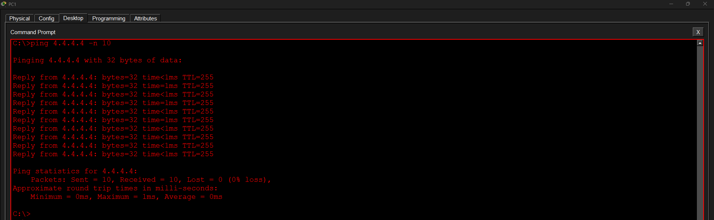

# OSPF Part 1

## Objective

Configure single-area OSPF and verify routing.

## Tasks Completed

- Configured IP addresses
- Configured loopback interfaces
- Enabled OSPF on all routers
- Configured passive interfaces
- Advertised a default route
- Verified routing tables
- Verified end-to-end connectivity

## Result

Successfully configured and verified single-area OSPF.

## Screenshots

### 1. Topology

### 2. R1 OSPF Configuration

### 3. R2 OSPF Configuration

### 4. R3 OSPF Configuration

### 5. R4 OSPF Configuration

### 6. Routing Table Verification

### 7. Ping Verification

