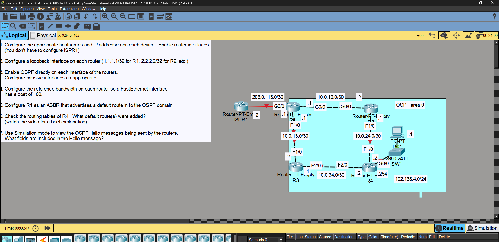
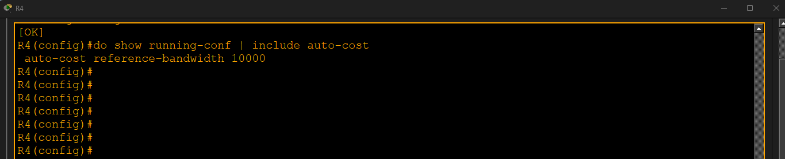
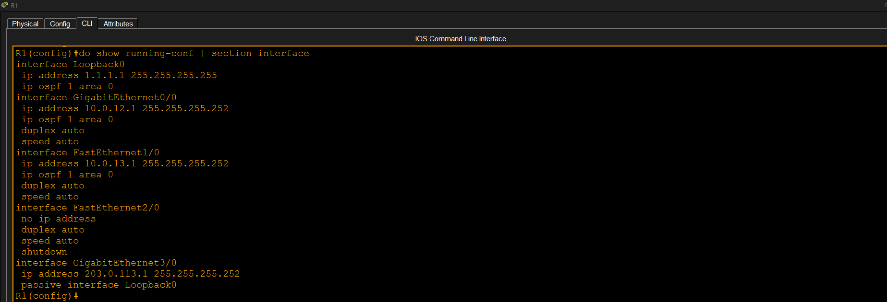
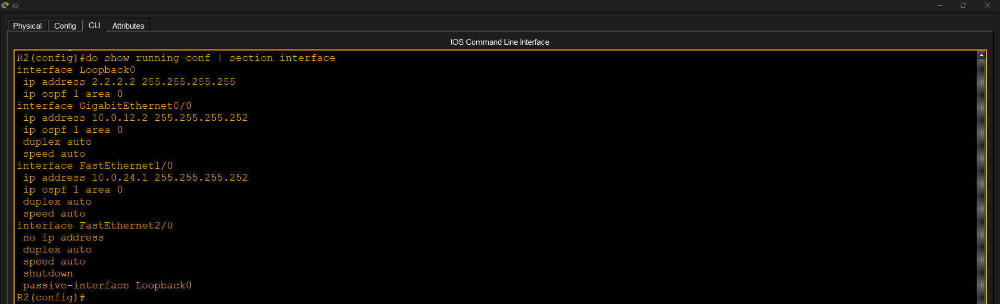
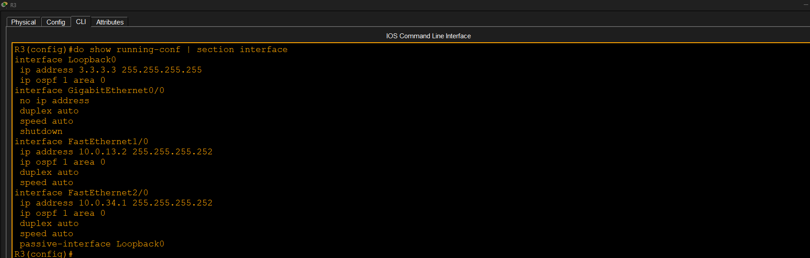
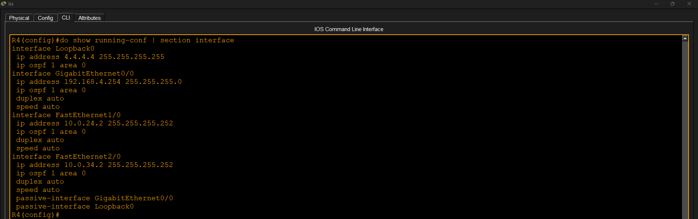
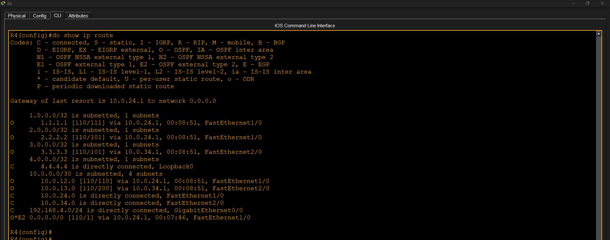
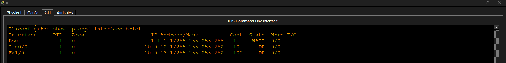
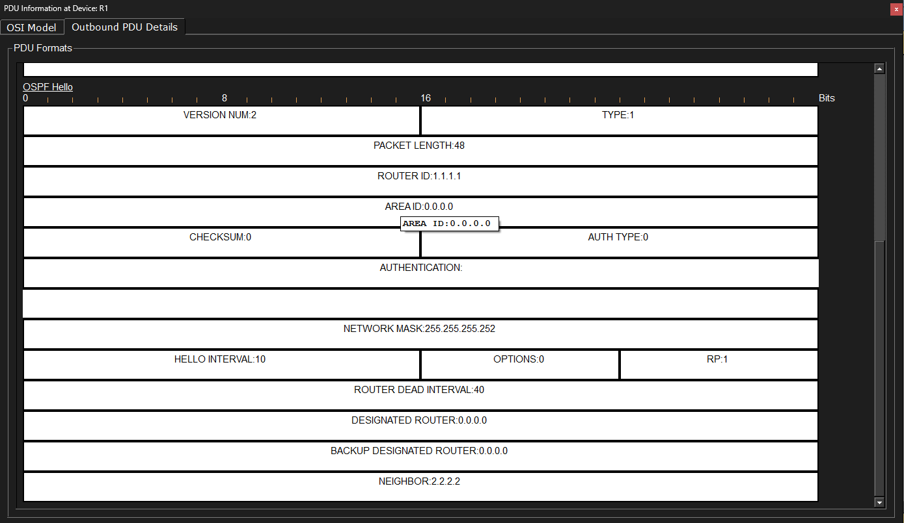
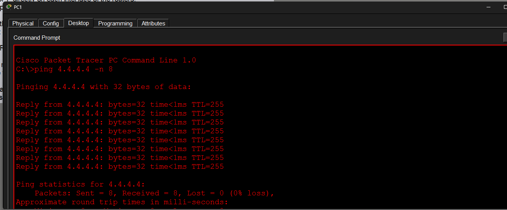

# OSPF Part 2

## Objective

Configure OSPF directly on router interfaces, configure passive interfaces, modify the OSPF reference bandwidth, verify OSPF operation, and inspect OSPF Hello packets.

## Tasks Completed

- Configured OSPF using interface commands
- Configured passive interfaces
- Configured reference bandwidth to 10000 Mbps
- Verified routing tables
- Verified OSPF interfaces
- Captured an OSPF Hello packet
- Verified end-to-end connectivity

## Result

Successfully configured and verified OSPF interface-based configuration, reference bandwidth, OSPF Hello packets, and end-to-end connectivity.

## Screenshots

### 1. Topology

### 2. Reference Bandwidth

### 3. R1 OSPF Interface Configuration

### 4. R2 OSPF Interface Configuration

### 5. R3 OSPF Interface Configuration

### 6. R4 OSPF Interface Configuration

### 7. Routing Table Verification

### 8. OSPF Interface Verification

### 9. OSPF Hello Packet

### 10. Ping Verification

