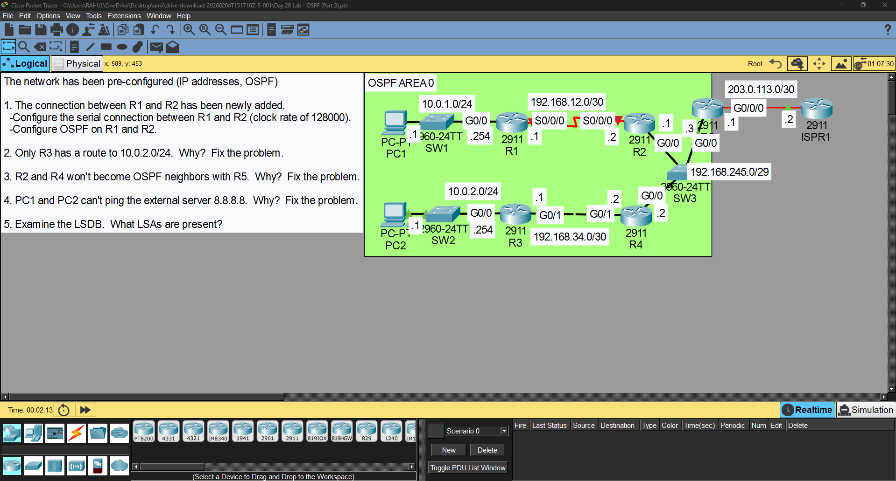
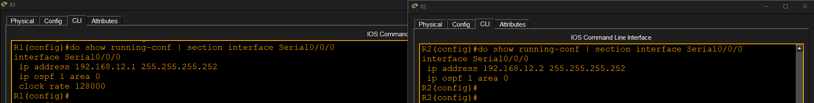
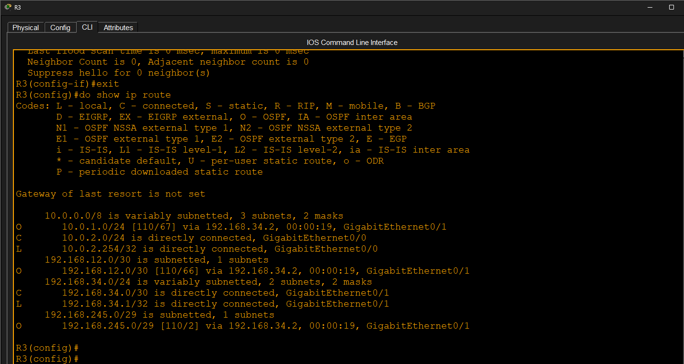
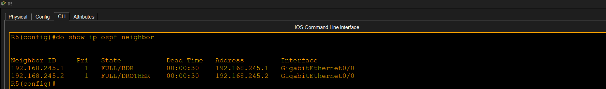
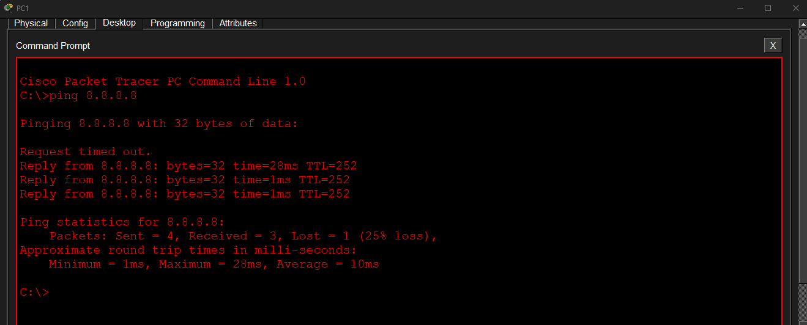
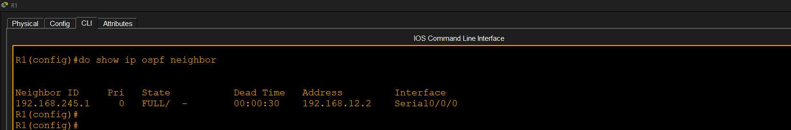
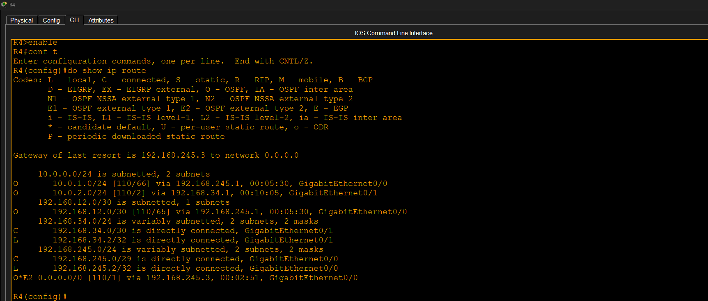
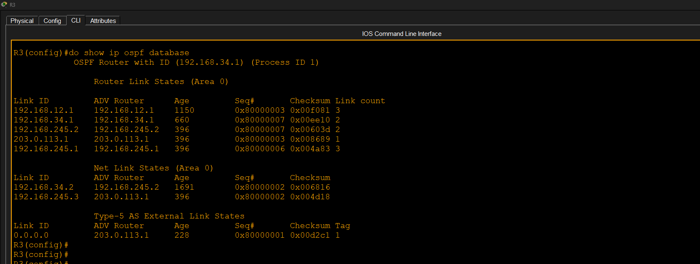

# OSPF Part 3

## Objective

Troubleshoot and resolve common OSPF issues, restore neighbor adjacencies, verify routing, and examine the OSPF Link-State Database (LSDB).

## Tasks Completed

- Configured the new serial link between R1 and R2
- Fixed missing OSPF route on R3
- Restored OSPF neighbor adjacency with R5
- Verified Internet connectivity
- Verified OSPF neighbors
- Verified routing table
- Examined the OSPF LSDB

## Result

Successfully troubleshot and restored OSPF operation. All routers formed neighbor relationships, routing was restored, and end-to-end connectivity was verified.

## Screenshots

### 1. Topology

### 2. R1-R2 Serial Configuration

### 3. R3 Route Fixed

### 4. R5 Neighbor Fix

### 5. Internet Ping Verification

### 6. OSPF Neighbor Table

### 7. Routing Table

### 8. OSPF Database

