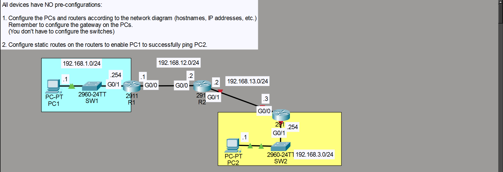
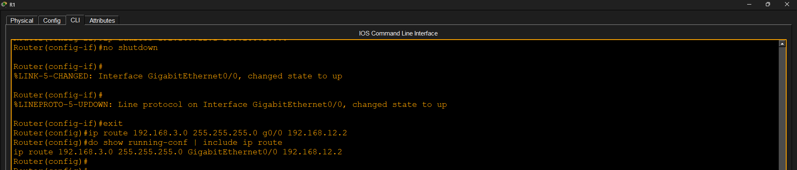
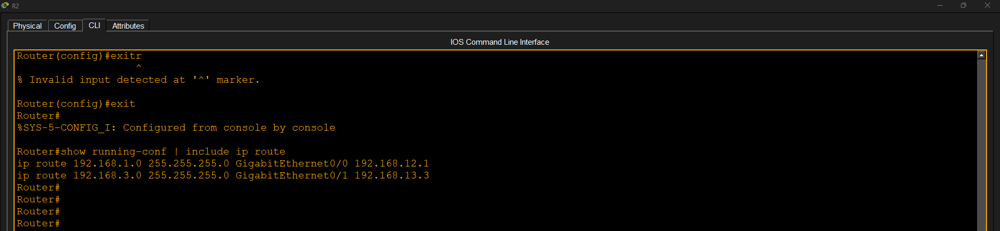
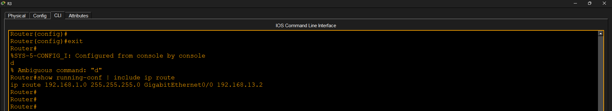
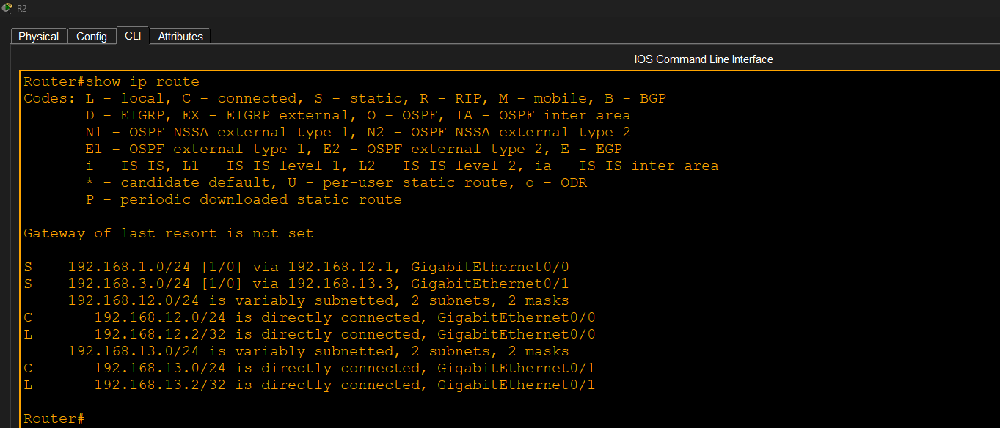
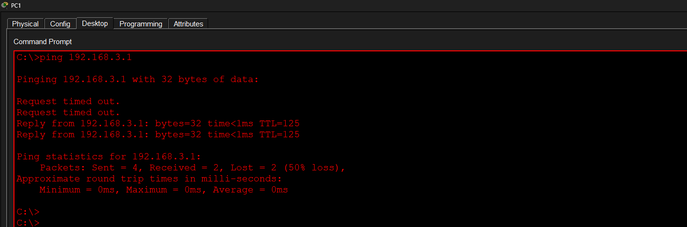

# Static Routing

## Objective

Configure static routes between multiple routers to enable end-to-end communication.

## Tasks Performed

- Configured IP addresses on routers and PCs
- Configured default gateways on PCs
- Configured static routes on all routers
- Verified routing tables
- Verified end-to-end connectivity using ping

## Result

Successfully established connectivity between PC1 and PC2 using static routing.

## Screenshots

### 1. Topology

### 2. R1 Static Route Configuration

### 3. R2 Static Route Configuration

### 4. R3 Static Route Configuration

### 5. Routing Table Verification

### 6. Ping Verification

