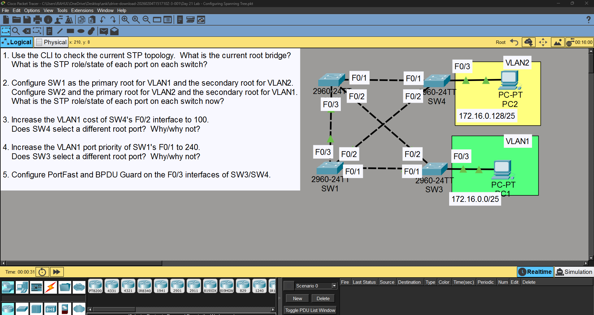
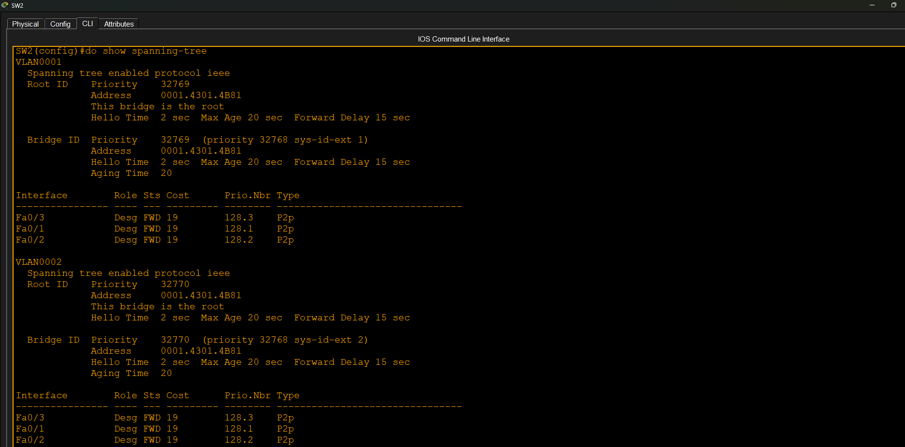
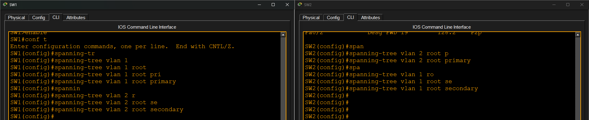
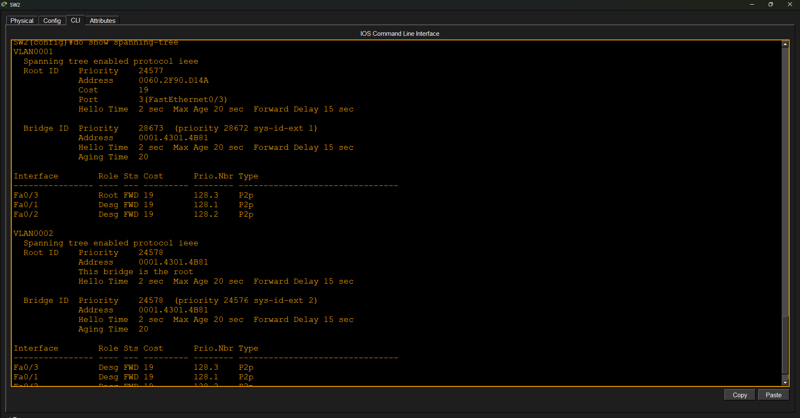
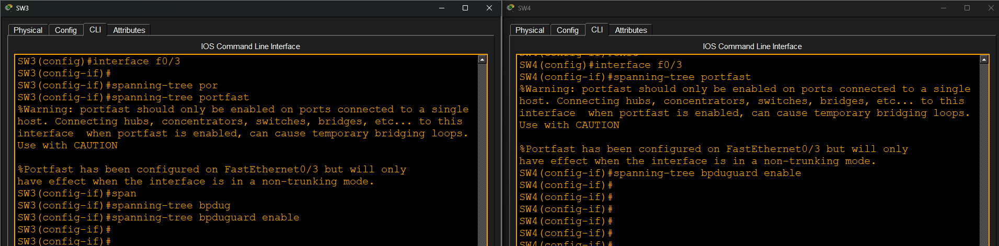

# Configuring Spanning Tree Protocol (STP)

## Source

This lab topology is based on Jeremy's IT Lab CCNA course and was completed as part of my hands-on networking practice.

## Objective

The goal of this lab was to understand how Spanning Tree Protocol (STP) prevents Layer 2 loops by electing a root bridge, assigning port roles, and providing redundant paths. The lab also demonstrates root bridge selection, path cost, port priority, PortFast, and BPDU Guard.

## Topology

- 4 Cisco 2960 switches
- 2 VLANs (VLAN 1 and VLAN 2)
- Redundant Layer 2 links
- PCs connected as access devices

## Tasks Completed

- Verified the initial STP topology
- Identified the current root bridge
- Configured SW1 as the primary root for VLAN 1
- Configured SW1 as the secondary root for VLAN 2
- Configured SW2 as the primary root for VLAN 2
- Configured SW2 as the secondary root for VLAN 1
- Modified STP path cost
- Modified STP port priority
- Configured PortFast on access ports
- Configured BPDU Guard on access ports

## Verification

- Verified root bridge election
- Verified STP port roles and states
- Verified STP topology changes after root bridge configuration
- Verified PortFast configuration
- Verified BPDU Guard configuration

## Key Learning Points

- STP prevents Layer 2 switching loops.
- Every VLAN elects its own root bridge.
- Root bridge selection is based on Bridge ID.
- Port cost influences root port selection.
- Port priority affects tie-breaking during path selection.
- PortFast speeds up access port transitions.
- BPDU Guard protects access ports from accidental switch connections.

## Result

Successfully configured and verified Spanning Tree Protocol (STP), including root bridge election, port role selection, PortFast, and BPDU Guard.

## Screenshots

### Topology

### Initial STP Topology

### Root Bridge Configuration

### STP After Configuration

### PortFast & BPDU Guard

