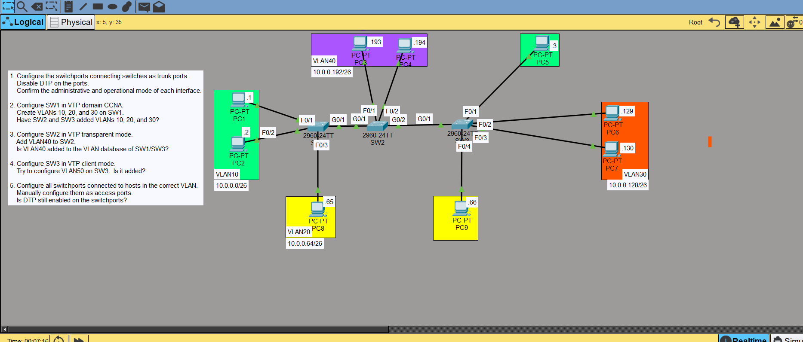
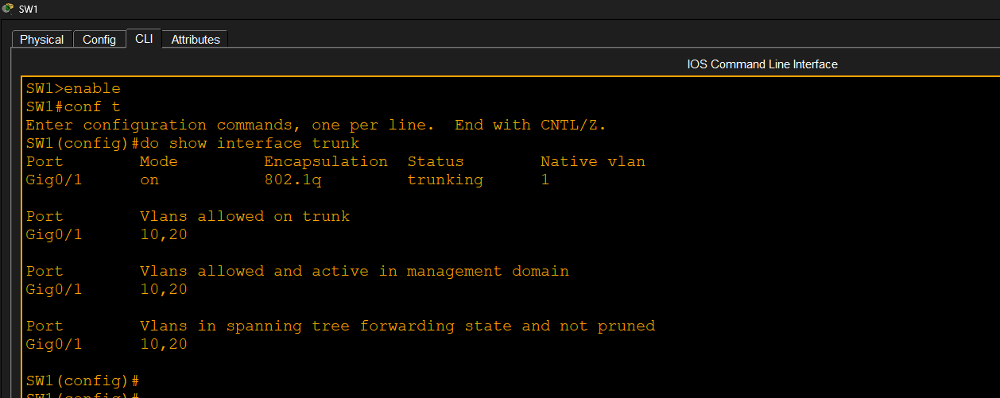
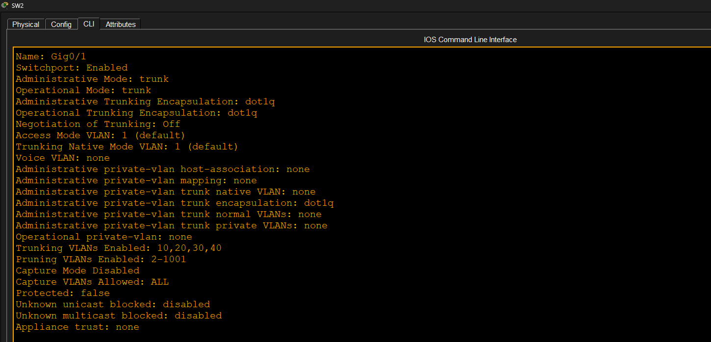
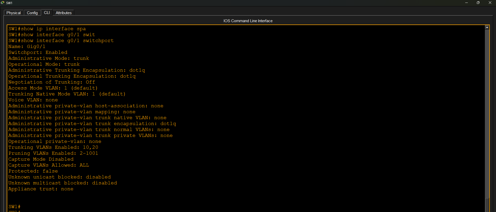
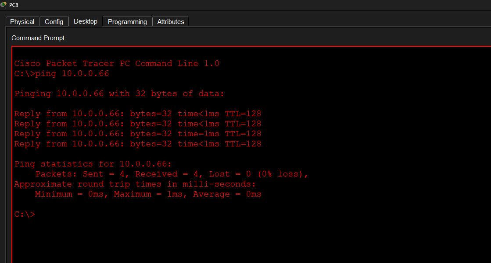

# Dynamic Trunking Protocol (DTP)

## Source

This lab topology was inspired by Jeremy's IT Lab CCNA course and was completed as part of my hands-on networking practice.

## Objective

Configure and verify Dynamic Trunking Protocol (DTP) between Cisco switches.

## Tasks Completed

- Configured trunk links
- Configured DTP negotiation
- Verified trunk establishment
- Verified VLAN communication over trunk links
- Verified DTP behavior using Cisco IOS commands

## Verification

- Trunk status verified
- Switchport status verified
- End-to-end connectivity verified

## Key Learning Points

- DTP is a Cisco proprietary protocol.
- DTP negotiates trunk links automatically.
- Common modes:
  - dynamic auto
  - dynamic desirable
  - trunk
  - access
- DTP can be disabled using `switchport nonegotiate`.

## Result

Successfully configured and verified Dynamic Trunking Protocol (DTP).

## Screenshots

### Topology

### Trunk Verification

### Switchport Verification

### DTP Verification

### Ping Verification

