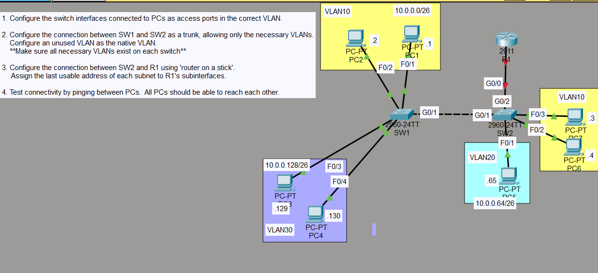
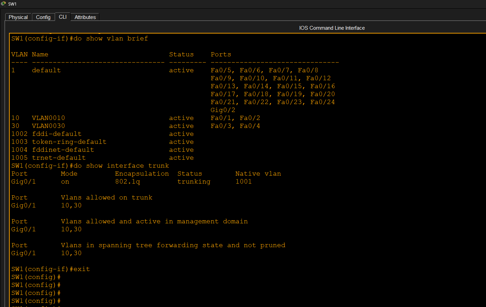
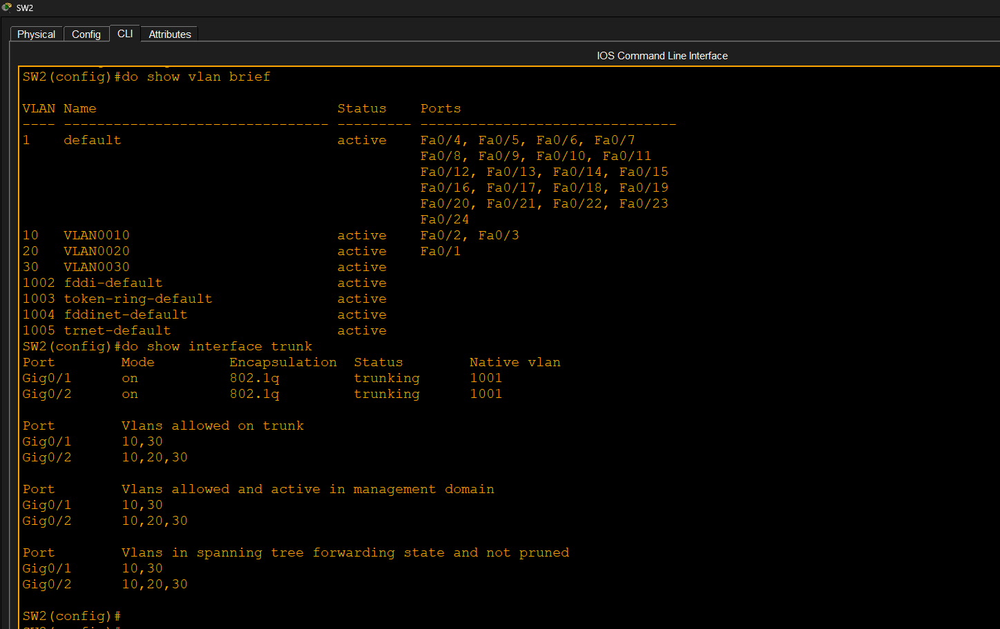
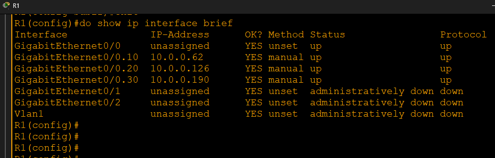
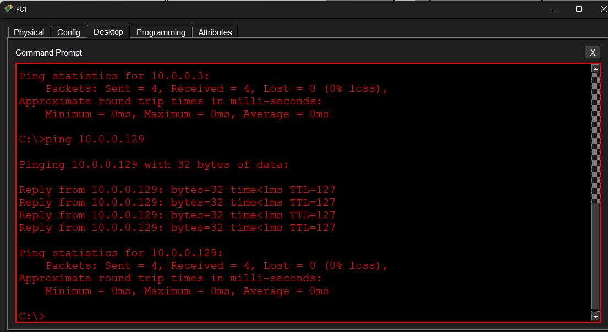
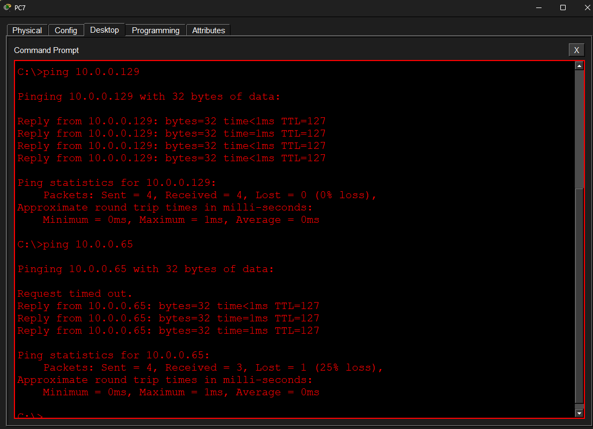

# Router-on-a-Stick (ROAS)

## Objective

Configure Inter-VLAN Routing using Router-on-a-Stick (ROAS).

## VLANs

| VLAN | Network | Gateway |
|------|---------|---------|
| 10 | 10.0.0.0/26 | 10.0.0.62 |
| 20 | 10.0.0.64/26 | 10.0.0.126 |
| 30 | 10.0.0.128/26 | 10.0.0.190 |

## Tasks Completed

* Configured VLANs
* Configured Access Ports
* Configured Trunks
* Configured Native VLAN
* Configured Router Subinterfaces
* Verified Inter-VLAN Routing

## Result

Successful communication between all VLANs using Router-on-a-Stick.
## Result

Successful communication between all VLANs using Router-on-a-Stick (ROAS).

## Screenshots

### Topology

### VLAN Verification

### Trunk Verification

### Router Subinterfaces

### Ping Verification

