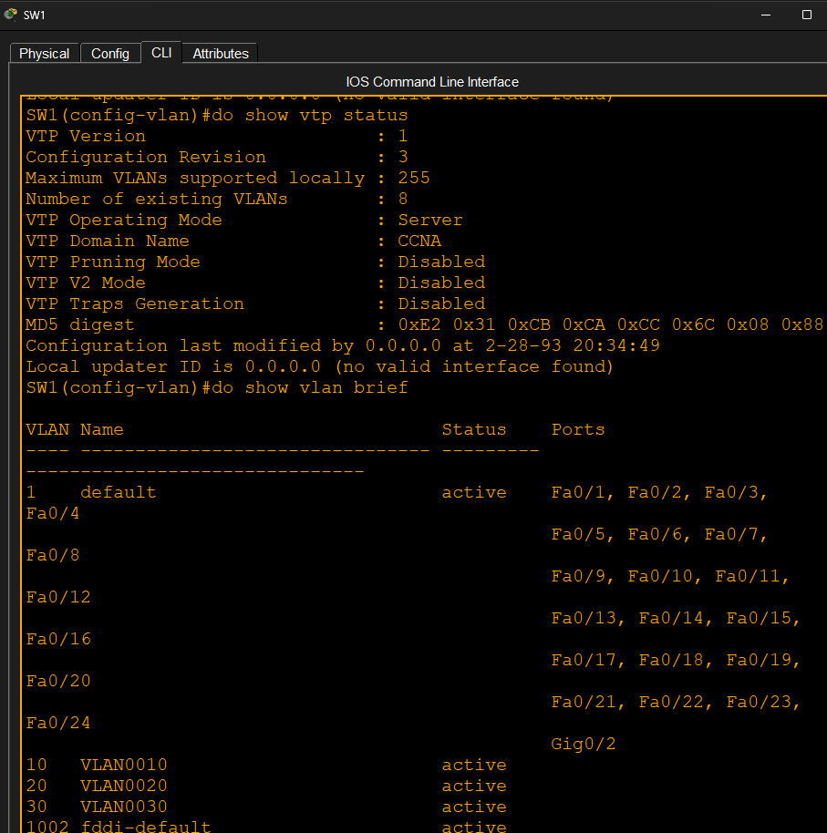
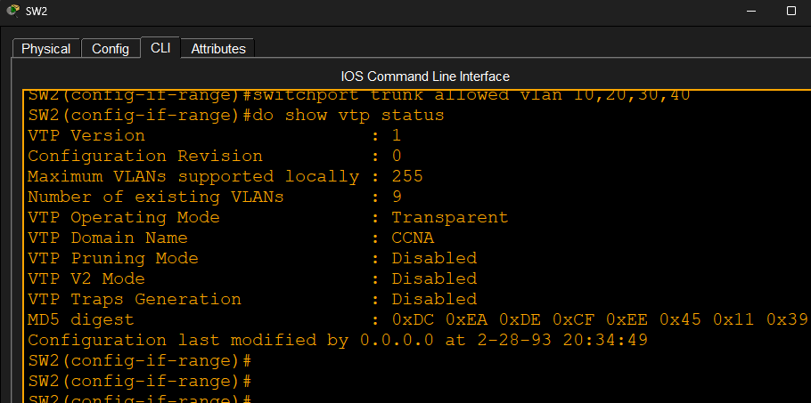
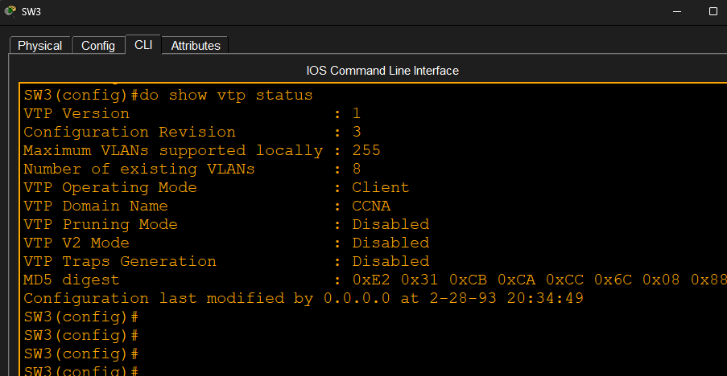
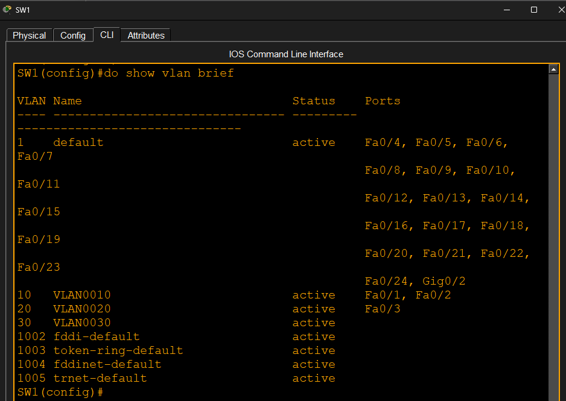
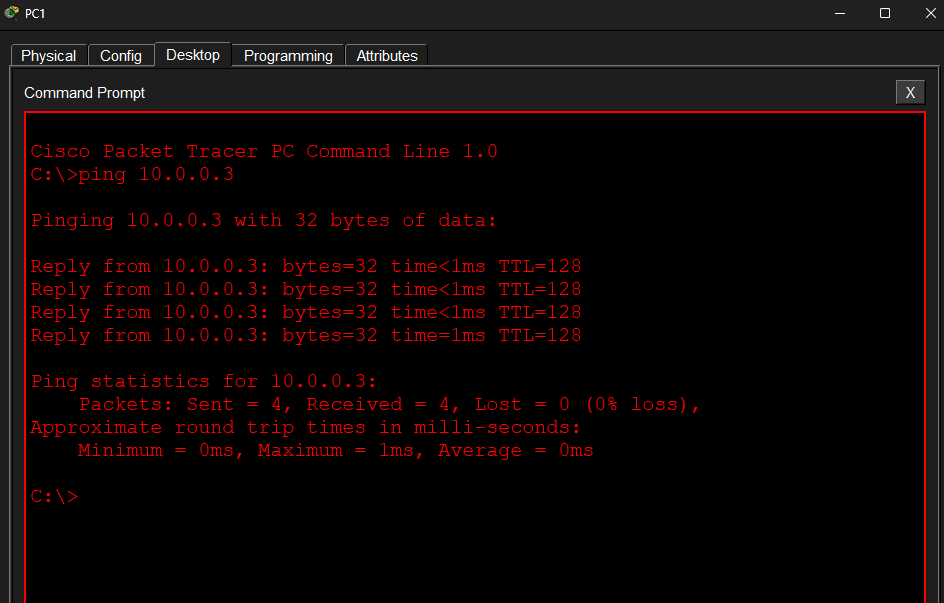

# VLAN Trunking Protocol (VTP)

## Source

This lab was completed as part of my CCNA studies.

## Objective

- Configure VTP Server, Client, and Transparent modes
- Create VLANs using VTP
- Verify VLAN propagation
- Verify behavior of Transparent and Client modes

## Topology

[Topology screenshot]

## Tasks Completed

- Configured trunk links between switches
- Configured SW1 as VTP Server
- Configured SW2 as VTP Transparent
- Configured SW3 as VTP Client
- Created VLANs 10, 20, and 30 on the VTP Server
- Created VLAN40 on the Transparent switch
- Verified VLAN database synchronization
- Verified Client mode restrictions

## Verification

- VTP status verified on all switches
- VLAN propagation verified
- End-to-end connectivity verified

## Key Learning Points

- VTP Server stores and advertises VLAN information
- VTP Client receives VLAN information but cannot create VLANs
- VTP Transparent forwards advertisements but maintains its own VLAN database
- Trunk links are required for VTP advertisements

## Result

Successfully configured and verified VTP operation across multiple switches.

## Screenshots

### Topology

### VTP Server Status

### VTP Transparent Status

### VTP Client Status

### VLAN Verification

### Connectivity Test

